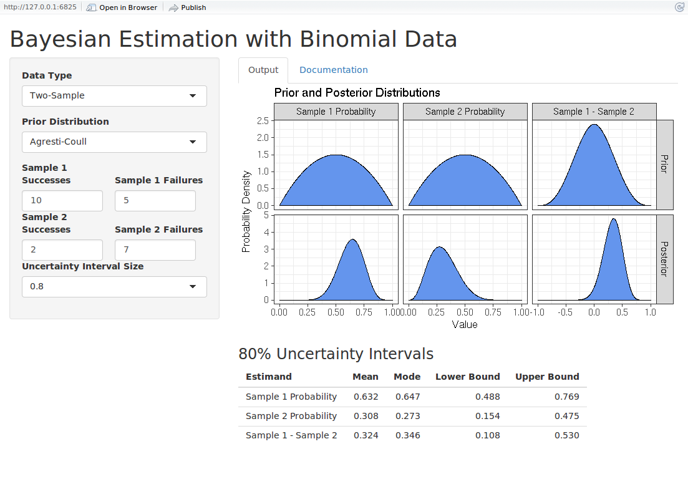

Shiny App Pitch: Introduction to Bayesian Inference
========================================================
author: J. Mark Shoun
date: 30 November 2016
width: 1440
height: 900

Bayesian Inference App
========================================================



***

* [My application](https://jmshoun.shinyapps.io/data-product-final/) allows the user to experiment with Bayesian inference
* Presents simple but useful problem: one- and two-sample inference from binomial data
* Solves two problems with most intro statistics courses
* Source code for the application is [hosted here](https://github.com/jmshoun/data-product-final)

Problem #1: Frequentist Binomial Inference is Hard
========================================================

**Problem:**
* Exact one-sample confidence intervals are on discrete distribution
* Using normal approximation requires continuity correction
* Normal approximation doesn't work for small or extreme data
* Exact inference for two-sample data is complex.
    
***

**Solution:**
* Bayesian intervals are from continuous distributions
    * No approximation or discretization needed!
* Two-sample inference isn't much harder than one-sample

Problem #2: Bayes' Theorem Is Given Short Shrift
========================================================

**Problem:**
* Bayes' Theorem is a part of the standard curriculum, but...
* Only discrete examples are discussed (no continuous estimands)
* Choices of prior aren't discussed in detail
* Math for continuous Bayesian inference is considered intimidating

***

**Solution:**
* Show a simple but practical problem where the math is tractable
* Visualize the prior and posterior distributions to foster intuition
* Automatically take care of technical details

Mathematical Details: How It Works
=========================================================

- The beta distribution is a *conjugate prior* for binomial/Bernoulli data
- If your prior distribution is beta, so is your posterior
- The beta distribution is included in R
- Easy example of how it works:
    - Find a 90% uncertainty interval
    - For 10 observed successes and 5 observed failures
    - Assuming a uniform prior on the probability scale
    

```r
interval.quantiles <- c(.05, .95)
successes <- 10
failures <- 5
qbeta(interval.quantiles, successes + 1, failures + 1)
```

```
[1] 0.4516529 0.8222341
```
